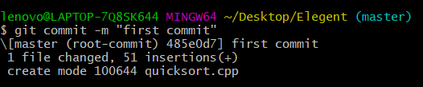

# 本地仓库绑定Github仓库

## 本地config设置（告诉git是谁在操作仓库）

设置username和email

```bash
$ git config --global user.name  "name"//自定义用户名
$ git config --global user.email "youxiang@qq.com"//用户邮箱
```

修改

```bash
git config --global configname configvalue
```

查询

```bash
git config --global configname
```

查询全部

```bash
git config --list
```

## 初始化本地仓库

### 1. 新建本地git仓库（相当于新建文件夹）

打开需要建立仓库的文件夹，在文件夹内打开Git Bash输入以下代码
以下图为例

 

打开文件夹

   ```bash
   git init #初始化git 
   ```

   出现以下界面

   

   这时查看文件夹

   

   文件夹里多了个.git文件夹，它是Git用来跟踪和管理版本库的。

### 2. 源代码放入本地仓库

把项目/源代码粘贴到这个本地Git仓库里面


```bash
git status #查看当前的状态
```

* 红字表示未add到Git仓库上的文件
* 绿字表示已add到Git仓库上的文件


然后通过git add把项目/源代码添加到仓库
（“git add .” ：把该目录下的所有文件添加到仓库，注意点“.”）

可以看到，查询状态后文件已经变为绿色，说明add成功


### 3. 提交仓库

用"git commit"项目提交到仓库。
-m 后面引号里面是本次提交的注释内容，可以不写，但最好写上，不然会报错

```bash
git commit -m "first commit"
```



## 链接github与本地git仓库

本地Git仓库和GitHub仓库之间的传输是通过SSH加密传输的，所以需要配置ssh key。

### 1.创建 SSH Key

在用户主目录下，查询是否存在“.ssh”文件。
本机用户主目录为图中所示路径：


* 如果有，再看文件下有没有id_rsa和id_rsa.pub这两个文件，如果也有，可直接到下一步。

* 如果没有，在开始附录里找到Git Bash，输入命令，创建SSH Key.


输入

```bash
$ ssh-keygen -t rsa -C "youxiang@qq.com" #引号内是github注册使用的邮箱!!
```

红色三行出现时，直接回车


再查看.ssh时，已经有“id_rsa”，“id_rsa.pub”文件。

SSH Key的秘钥对：id_rsa是私钥，不能泄露；id_rsa.pub是公钥，可以公开。

### 2.github填写SSH Key

打开“Account settings”–“SSH Keys”页面


点击“Add SSH Key”


title随意，key填写id_rsa.pub的全部内容


### 3.验证是否成功绑定

* 验证是否成功，在git bash里输入下面的命令

```bash
$ ssh -T git@github.com 
```

初次设置需要输入yes，出现第二个红框内容表示成功。


### 4.建github仓库

建立一个名称为“Elegent”仓库，这里不要勾选initialize，否则后面可能报错。


### 5.关联远程仓库

根据创建好的Git仓库页面的提示（找自己仓库的提示代码），可以在本地Elegent仓库的命令行输入：

```bash
git remote add origin https://github.com/xu-xiaoya/Elegent.git
```


### 6.将本地仓库中的内容上传推送

关联好之后我们就可以把本地库的所有内容推送到远程仓库（也就是Github）上了，通过在Bash输入：

* 由于新建的远程仓库是空的，所以要加上-u这个参数

```bash
git push -u origin master
```

* 之后仓库不是空的，就不用加上-u

```bash
git push origin master
```

上传项目的过程可能需要等一段时间........
........
........
.................
第一次可能会弹窗授权登录，点一下授权就行了
........
........
完成后如下图所示


这个时候进入github仓库，就可以看到新加的文件


>原文：https://blog.csdn.net/qq_29493173/article/details/113094143

### 总结步骤与常见问题

1. 步骤：

* 初始化：本地建库（即文件夹），git init
* 添加到仓库：代码文件放入本地库，git add .
* 提交： git commit -m “注释内容”，提交到仓库
* 新建远程仓库并关联：在Github上设置好SSH密钥后，新建一个远程仓库， git remote add origin https://github.com/xu-xiaoya/Elegent.git关联
* 推送：git push (-u) origin master，把本地仓库的代码推送到远程仓库Github上

2. 常见问题

问题：新建远程仓库的时候勾选Initialize this repository with a README，推送时可能会报failed to push some refs to https://github.com/xu-xiaoya/Elegent.git的错。

解决方案：这是由于你新创建的那个仓库里面的README文件不在本地仓库目录中，这时可以同步内容。

```bash
$ git pull --rebase origin master
```

之后再进行git push origin master就能成功了。


# 常用Git命令

111
