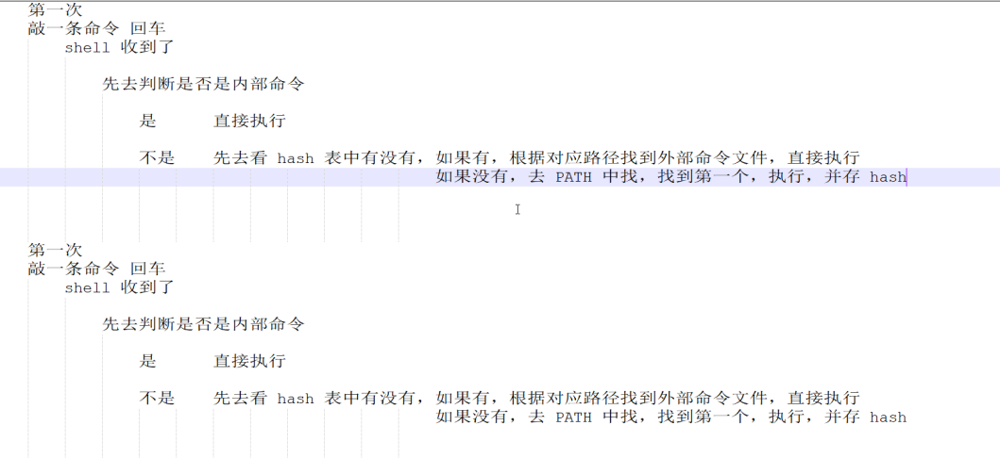

# DAY1

## 行业介绍

没啥新知识

## 计算机基础

也没啥新知识

---

## Linux虚拟机安装


# DAY2
## Linux 基础
用户
* root用户

* 普通用户

## 终端 terminal

终端是console控制台和tty终端集合，

tty源于Teletypes，原指电传打字机，是通过串行总线用打印机键盘通过阅读

## SHELL

>shell 用户和机器的交互式接口
>shell是一种命令解释语言--接受用户命令他，然后执行
>shell是一种编程语言----shell脚本


```bash
hostname        #临时修改主机名
hostnamectl     #永久修改主机名
```


### 命令的执行过程



